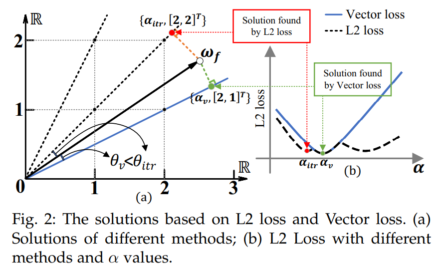
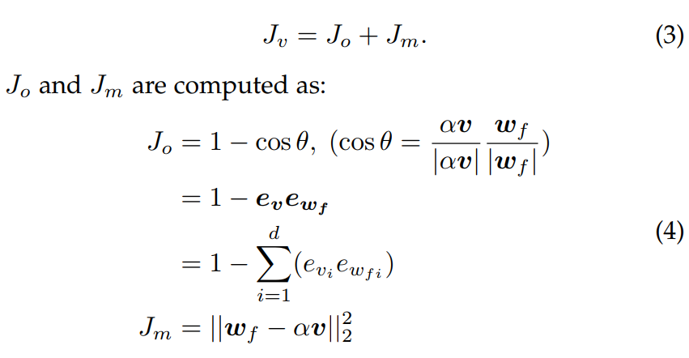
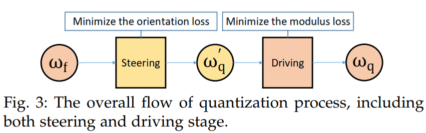
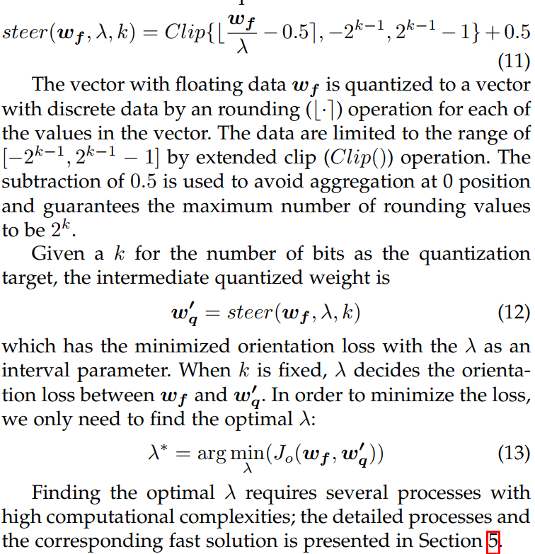
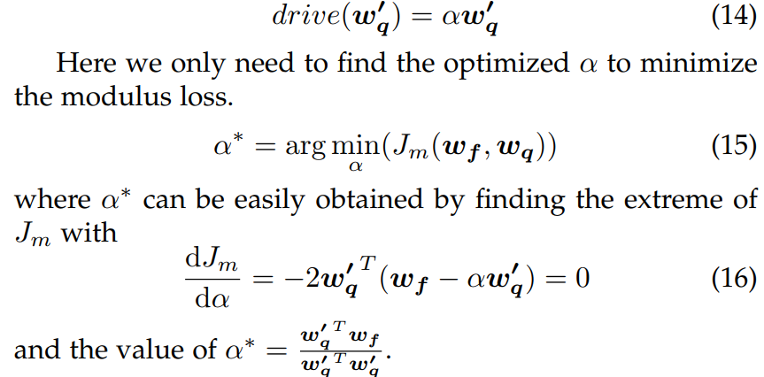

# VecQ 向量化参数量化方法
> VecQ: Minimal Loss DNN Model Compression With Vectorized Weight Quantization.
Cheng Gong, Yao Chen, Ye Lu, Tao Li, Cong Hao, Deming Chen, Fellow, IEEE
## 向量化量化概述
### 为什么向量化
传统的量化方法基本都采用L2 loss来选择模型量化最优参数，而其虽然效果尚可，但任然存在一些问题。

如上图图(b)所示，由于在k位约束下优化L2 loss的非凸特性，采用L2 loss迭代方法找到的最优解为红点，虽然是极值点，但可能并不是最优解；而采用向量化损失求解，恰好能解决上述问题。

### 何为向量化量化
简单来说，向量化量化方法就是将深度学习网络中某层或某通道的权重参数量化后的损失拆分为方向损失Jo与模损失Jm，根据这两种损失（而非L2损失）来调整量化参数进而实现模型量化的方法。

在论文中，作者给出了Jo与Jm的定义，并且将二者之和定义为向量化损失Jv。

在分析表达式之后，可以发现，Jo与Jm的优化可以独立实现，这才有了后续的向量化量化方法。
## 向量化量化流程
理论分析之后，作者提出了一种向量化量化方案，如下图所示。

其中，Steering代表最小化方向损失，Driving代表最小化模损失。

关于Steering操作，有：

关于Driving操作，有:

