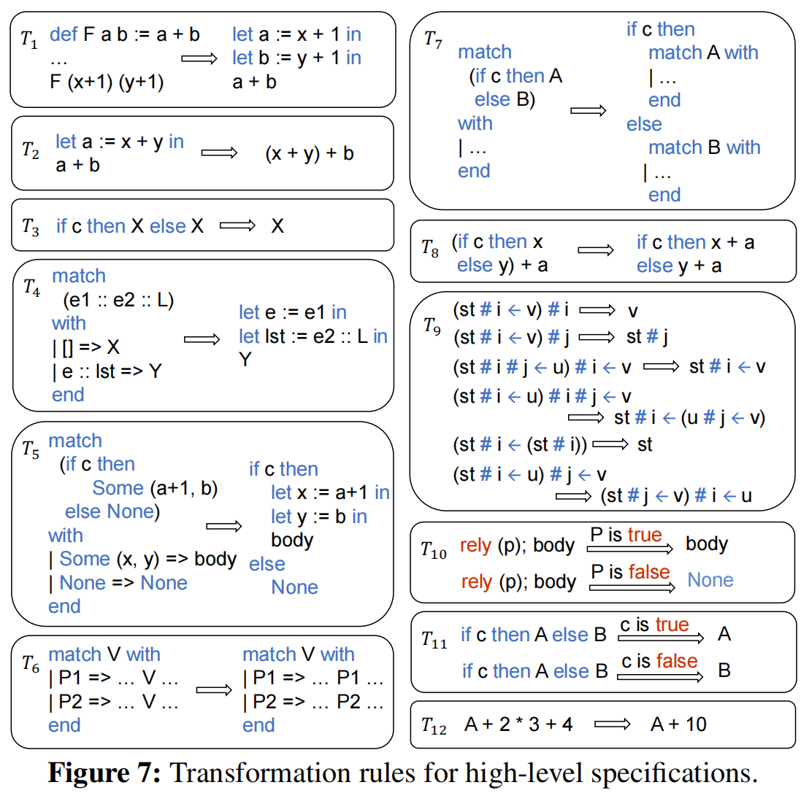
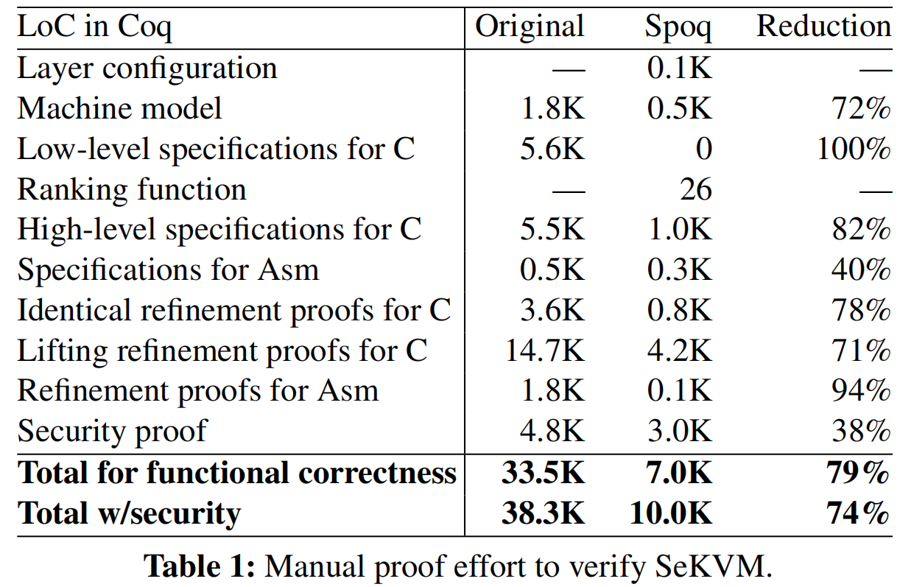

# Spoq: Scaling Machine-Checkable Systems Verification in Coq
> Xupeng Li, Xuheng Li, Wei Qiang, Ronghui Gu, and Jason Nieh, Columbia University

---
## 概述
系统软件由于其代码复杂度较高，形式化验证往往较难。论文提出了一个新的自动化程序验证框架Spoq，以降低系统软件的程序化验证成本。论文的主要贡献和特点包括：
- Spoq能够自动将**未修改的**C系统代码（如Linux内核中的代码）翻译成Coq表示，这是首个能够实现这一功能的系统。
- Spoq支持完整的C语言语义，包括GNU C特定扩展和内联汇编代码。
- Spoq利用**分层证明策略**，通过定义实现的层结构，将验证分解为更小的步骤，使每个验证步骤更容易完成。
- Spoq自动生成Coq层规范和精化证明，这是首个能够为并发系统软件自动化生成层规范和证明的系统。
- Spoq减少了进行源代码级机械验证的信任计算基础（TCB），因为生成规范和证明的过程不需要信任Spoq。
- Spoq在实际的系统软件上进行了评估，展示了其在验证多处理器（SeKVM）虚拟机实现方面的有效性。

利用Clang编译器前端将C代码解析为LLVM IR, 提出了一直新的程序重建技术，将LLVM IR CFG 转换为 Coq表示。这使Spoq成为第一个可以自动转换**未修改的**C系统代码的系统

Spoq引入了一种新的程序结构重构技术，利用LLVM将C代码翻译成Coq，支持完整的C语义，使得源代码不再需要手动修改即可进行验证。此外，Spoq利用分层证明策略，并引入了新的Coq策略和转换规则，自动生成层规范和精化证明，简化了并发系统软件的验证。Spoq还支持轻松集成手动编写的层规范和精化证明。

## 引言

系统软件（如操作系统和虚拟机）是计算基础设施的软件基础。然而，现代系统软件因其规模庞大、结构复杂，存在许多可能被利用的安全漏洞。为了解决这一问题，形式化验证提供了一种潜在的解决方案，它通过数学证明来确保系统软件能够提供关键的安全保证。但是，实现功能正确性（即软件实现满足其规范）是形式化验证中最具有挑战性的部分，因为系统软件实现的复杂性。这些实现通常用C语言编写，C语言具有复杂的语义和特性，许多特性不被验证工具支持。此外，用于验证更高级别属性（如安全性）的高层规范与实现之间存在显著的语义差距，需要大量的手动证明工作来弥合这一差距。如果没有功能正确性来确保证明适用于实际实现，形式化验证的保证在实践中可能毫无意义。

为了解决这些问题，论文提出了Spoq框架。Spoq旨在通过自动化Coq证明过程来降低证明成本，同时确保所有证明都是机器可检查的。Spoq专注于简化功能正确性的正式验证，以降低证明成本，同时确保所有证明都由定理证明器进行机器检查，并验证到实际软件实现。Spoq操作在广泛使用的未修改的C代码上，并利用Coq证明助手来启用复杂系统的机器可检查验证。其关键特性是通过自动化编写Coq规范和证明的许多方面，使Coq更易于使用。这减少了需要手动编写的Coq代码量，从而显著降低了进行机器可检查验证所需的时间。

Spoq是第一个能够自动将未修改的C系统代码（如Linux内核中的代码）翻译成Coq表示的系统，以便进行验证。以前的方法是CompCert的ClightGen，它只支持C语言的一个子集。使用ClightGen的系统（如CertiKOS）需要在验证之前对系统实现进行大量手动修改，额外的工作来开发和维护修改后的版本，并且仍然不能为实际运行版本提供任何经过验证的保证。Spoq通过利用广泛使用的Clang编译器前端解析C代码到LLVM的独立于语言的中间表示（IR）来解决这个问题。Spoq引入了一种新的程序重建技术，将控制流图（CFG）转换回使用if-then-else和循环语句的Coq表示，这更适合于验证。这种方法使Spoq能够支持完整的C语言语义，包括GNU C特定扩展和内联汇编代码，同时工作与为自动翻译到另一种表示而设计的具有清晰语义的IR。Spoq还利用基于并发认证抽象层（CCAL）的分层证明策略，将验证模块化和分解为更小的步骤，使每个验证步骤更容易完成。这涉及到定义实现的层次结构，其中每个层次由一组定义层次接口的函数组成。更高层次可以调用较低层次接口暴露的函数，但不能反向调用。最高层是整个实现行为的高层规范，而底层是一个机器模型，其接口旨在支持LLVM IR语义。验证涉及证明层次组合地精炼了整个实现的最上层规范。

尽管Spoq依赖于未经验证的Clang，但大多数系统软件已经需要信任广泛使用的Clang或未经验证的替代品，如GNU C编译器，以生成实际运行的可执行代码。Spoq尚未验证的部分需要信任的是其从LLVM IR到Coq的翻译器，这部分设计得非常小。这个TCB比CompCert的ClightGen小得多，后者更大且更复杂，因为它需要直接解析和翻译C代码，这是一个更困难和涉及的过程。论文还提到了Spoq在商品系统软件上的实现和评估，展示了Spoq在将C系统代码转换为Coq表示方面的有效性，以及在验证多处理器KVM虚拟机实现时减少手动证明工作量的能力。

## Spoq Usage Model
要利用Spoq进行系统软件验证，首先，用户需要将源代码编译成LLVM中间表示（IR），这是一个与语言无关的中间代码形式。接着，用户需要编写一个层次配置文件（定义了验证的层次结构）。分层的目的是将证明过程模块化，确保每个层次的函数只能调用更低层次的函数。例如，如果源代码中有三个函数A、B和C，其中A调用B，B调用C，那么至少需要定义三个层次。

层次配置文件详细说明了每个层次的名称、每个层次中函数的名称、源IR代码的路径以及Coq项目的路径。此外，配置文件还应包括底层抽象机器模型的定义，包括机器状态的定义。Spoq根据这个配置文件生成Coq项目，包括所有层次的规范和证明。如果源代码或层次结构发生变化，用户可以重新运行Spoq来更新Coq项目，Spoq会根据变化重新生成受影响部分的规范和证明。

Spoq的设计允许用户轻松集成手动编写的规范和证明。如果Spoq生成的某个层次的规范不够简洁或精炼证明失败，用户可以手动编写规范或证明，并在层次配置文件中进行注释，以便Spoq使用这些用户提供的规范或证明。这种方法使得Spoq在验证功能正确性时非常有用，它可以生成顶层规范，确保实现满足规范。除此之外，Spoq还可以帮助用户验证更高级的系统属性，如安全性。用户可以使用Spoq生成的顶层规范来验证系统的整体安全属性，确保这些属性在实际运行的软件实现上成立。

<!-- ## Spoq框架概述
Spoq是第一个可以自动将未修改的C系统代码(例如在Linux内核中发现的代码)转换为Coq表示的系统，Spoq通过利用广泛使用的Clang编译器前端将C代码解析为LLVM独立于语言的中间表示IR(if-else流程图)
然后，Spoq利用基于并发认证抽象层(CCAL)的分层证明策略将验证模块化并分解为更小的步骤，使每个验证步骤更容易。
Spoq引入了一个Coq策略库来自动生成底层规范和实现与底层规范之间的精化证明。
带循环的函数被合成为Coq递归规范，然后使用归纳证明模板将其精化为规范。为了生成带有循环的函数的规范，为每个循环提供了一个排序函数，它在循环迭代期间是单调递减且非负的。Spoq利用排序函数来生成循环终止证明。
Spoq引入了转换规则来自动生成高级规范和低级和高级规范之间的精化证明。转换规则包括展开函数定义、从语法上重新组织程序结构、消除预先确定的分支和断言，以及执行数学简化。精化证明是通过引入自动生成的注释来跟踪转换是如何应用的，然后使用Coq策略来证明转换序列保留规范语义来完成的。 -->

## Spoq系统的工作流程

Spoq系统的流程图如下:


首先Spoq需要将程序转换为Coq表示的抽象语法树（AST），对应图中的步骤1。基于Clang编译器，Spoq可以将C代码转换为LLVM的中间表示(Intermediate Representation)，这一中间表示将程序表示为由多个函数基本块组合而成的控制流图(CFG)。Spoq接着引入了一种新的算法，将LLVM IR中的每个代码块合并，并使用if-then-else、loop、continue、break和return语句重建程序结构。对于没有循环的程序，Spoq基于四条基本规则从CFG重构程序。而对于有循环的程序，Spoq先计算其强联通分量（SCC），再基于四条附加重写规则将其转换为与循环相关的语句。这些规则如下图所示：


Spoq还通过将每一个汇编指令，转换为Coq表示的方式，处理汇编代码。并且通过将汇编代码提取到一个单独的过程中，Spoq可以将内联汇编与LLVM IR 解耦。

!!! note ""
    之后，Spoq将一个层（layer）配置文件作为输入，从而定义所有的层，以及不同函数应该在哪层被证明，最终可以基于CCALs构建机械化证明，对应图中步骤2，其证明类似于如下形式，表明构造在底层接口 $L$ 之上的实现 $M$，基于精化关系（refinement relation）$R$ 精化（refine）$L^{'}$。

$$ M @ L\sqsubseteq_{R} L^{'} $$

Spoq会为每一层生成低阶specification和细节化证明，对应于流程图中步骤3。对于没有循环的程序，这一过程是直接的。而对于有循环的程序，Spoq要求用户对循环提供一个非负的，在循环过程中单调递减的排序函数。从而使用Coq中的Fixpoint构造，自动生成递归函数作为低阶specification。Spoq使用一个统一的归纳模板以生成最终的refinement证明，对应流程图中的步骤4。

Spoq同样会对每一层生成高阶specification，并提升其refinement proof，对应流程图中的步骤5-6。当不使用数据抽象来隐藏低阶数据的表示细节，以简化高阶的证明时，这一过程可以自动完成。而如果需要进行数据抽象，则需要用户定制精化关系（refinement relation），定义抽象操作，并手动证明。
### 例

Spoq将层配置文件作为输入，使用ccal，我们可以构造一个机器可检查的证明对象 $M @ L\sqsubseteq_{R} L^{'}$显示了建立在底层接口 $L$之上的实现 $M$，通过细化关系 $R$对接口 $L^{'}$进行细化。
层结构假定底层为机器模型 $L_{0}$，Spoq通过识别源代码中的每个全局内存对象并在Coq中生成相应的机器状态来自动生成该模型。Spoq还为状态中的每个元素生成内存load/store原语(primitives)。原语以内存指针作为参数，并根据偏移量计算要访问的数组下标和结构元素。还包括索引边界和数据范围检查。
```C
// Layer interface L1
uint page[MAX_PAGE];
uint get_page (uint i) { return page[i] }
void set_page (uint i, uint s) { page[i] = s; }
// Layer interface L2
#define ALLOC() ({ 
    uint i; 
    for (i = 0; i < MAX_PAGE; i++){ 
        if (get_page(i) == 0) { 
            set_page(i, 1); 
            break; 
        } 
    } 
    i;})
uint alloc() { return ALLOC(); }
```
它将构建一个CCAL" $M_{page}@L_{0} \sqsubseteq_{R_{1}} L_{1}$ "，将页面数组抽象为一个从自然数到整数的Coq Map对象，这样它的元素只能分别通过getter和setter方法get_page和set_page来访问，而不能通过任意的内存操作来访问，这可能会导致意想不到的行为。细化关系R1定义了如何将页面数组抽象到Map对象中。然后，它将使用Map对象构建一个CCAL" $M_{malloc}@L_{1} \sqsubseteq_{id} L_{2}$"来验证L1之上的alloc函数，而无需担心page的具体实现细节。这里，id是一个相同的细化关系，因为在验证alloc时不需要数据抽象(后面5-6)。
#### 规范和细化证明步骤3-4：
Spoq会为每一层生成低阶规范和细节化证明，对应于流程图中步骤3。对于没有循环的程序，这一过程是直接得到的。而对于有循环的程序，Spoq要求用户对循环提供一个非负的，在循环过程中单调递减的排序函数。从而使用Coq中的Fixpoint函数结构体构造，自动生成递归函数作为低阶规范。Spoq使用一个统一的归纳模板以生成最终的精化证明，对应流程图中的步骤4。

!!! note ""
    利用重构的程序结构，Spoq简单地扫描Coq AST表示，从第一个语句开始进行案例分析，并根据定义的LLVM IR语义生成相应的Coq定义作为字符串。下面是赋值和分支语句的一小段Python伪代码:
```python
def spec_gen (ast, spec):
    for n in range(len(ast)):
        i = ast[n]
        if isinstance(i, IAssign): # Assignment case
            s = f"let {coq_name(i.asg)} := {val(i.v)} in"
            spec.append(s)
        elif isinstance(i, IIf): # Branch case
            spec.append(f"if {coq_name(i.cond)} then")
            spec_gen(i.true_body + ast[n+1:], spec)
            spec.append(f"else")
            spec_gen(i.false_body + ast[n+1:], spec)
    ...
```
!!! note ""
    Spoq使用Coq中的递归Fixpoint构造为循环生成低级规范。Fixpoint定义需要递减参数，其类型为 $Nat$，每次递归调用函数时递减。Spoq要求用户为每个循环提供一个排序函数作为递减参数。然后，它通过填充下面模板中标记为{{}}的部分来生成循环的低级规范:

```coq
Fixpoint _loop (n: nat) (bk rt: bool) {{Vi Vo}} st:=
    match n with
    | O => Some (bk, rt, {{Vo}}, st)
    | S n’ =>
        match _loop n’ bk rt {{Vi Vo}} st with
        | Some (bk’, rt’, {{Vo’}}, st’) =>
            if bk’ then Some (bk’, rt’, {{Vo’}}, st’)
            else if rt’ then Some (bk’, rt’, {{Vo’}}, st’)
            else {{low-level spec of the loop body}}
        | _ => None
        end
    end.
 Definition _low {{args}} (st: ST):=
    {{low-level spec before the loop}}
    let n := {{rank i_Vi}} in
    match _loop n false false {{i_Vi i_Vo}} st with
    | Some (bk, rt, {{Vo}}, st’) =>
        if rt then Some ({{Vo}}, st’)
        else {{low-level spec after the loop}}
    | _ => None
    end.
```
#### 转换规则
转换规则的目标是**简化所需的控制流并消除尽可能多的不必要的操作**。
Spoq同样会对每一层生成高阶规范，提升其精化证明，对应流程图中的步骤5-6。当不使用数据抽象来隐藏低阶数据的表示细节，以简化高阶的证明时，这一过程可以自动完成。而如果需要进行数据抽象，则需要用户手动定制精化关系（refinement relation），定义抽象操作，并手动证明。
数据抽象：
Spoq将层配置文件作为输入，用于使用ccal扩展构造机械化证明。例如图中的层配置运行示例定义get / set_page应该验证 $L_{0}$层之上,而alloc应验证层 $L_{1}$
```C
// Layer interface L1
uint page[MAX_PAGE];
uint get_page (uint i) { return page[i] }
void set_page (uint i, uint s) { page[i] = s; }
// Layer interface L2
#define ALLOC() ({ 
    uint i; 
    for (i = 0; i < MAX_PAGE; i++){ 
        if (get_page(i) == 0) { 
            set_page(i, 1); 
            break; 
        } 
    } 
    i;})
uint alloc() { return ALLOC(); }
```
例如 $L_{1}$层将数组“page”抽象为Coq Map类型st.page，并将底层 $L_{0}$的机器模型提供的内存操作load_mem和store_mem抽象为带有边界检查的Map操作(st.page#i和st.page#i<-s):由于数据抽象，层 $L_{1}$的提升精化证明不是自动化的，必须手动提供。另一方面， $L_{2}$层不使用数据抽象。对于 $L_{2}$层，Spoq通过应用一系列转换规则(包括展开定义、合并几乎重复的子表达式、消除预先确定的分支和断言，以及执行数学简化)，自动从低级规范生成高级规范。
```coq
(* Low-level specifications *)
Definition get_page_low (i: nat) (st: ST) :=
    load_mem st ("page", i * 4) u32.
Definition set_page_low (i s: nat) (st: ST) :=
    store_mem st ("page", i * 4) s u32.
(* High-level specifications in L1 *)
Definition get_page_high (i: nat) (st: ST) :=
    if 0 <=i< MAX_PAGE then Some st.page#i else None.
Definition set_page_high (i s: nat) (st: ST) :=
    if 0 <=i< MAX_PAGE then Some st.page#i<-s else None.
```
Spoq通过将一组转换规则应用于低级规范来生成高级规范，从而使低级规范自包含且简单。Spoq使用12个转换规则，而且可以很容易地添加其他规则。


## 评估
论文已经实现了一个Spoq原型，其中包括了三个组件：从系统源码到Coq的转换器，规则和证明生成器，以及用于LLVM IR，汇编语义和策略的Coq库。接着本文评估了使用Spoq将不同开源软件的C代码转换成coq的效率，以及对一个KVM hypervisor的验证。对不同开源系统C代码转换，其结果如下图所示：

从上图可以看出，在所有的应用程序，系统软件和linux内核中，Spoq成功地将源代码的99%转换成了Coq，剩余部分是由目前不支持的LLVM高级分支指令导致的。且其性能明显优于CLightGen。而且Spoq的实现也要小的多。

接着，在对seKVM（KVM/Arm的改进版本）的验证上，从下表可以看出，相比于手工编写的证明，Spoq极大地减少了证明行数（平均约90%），以及减少了70%的手动证明工作量。



## 结论

Spoq作为一个自动化的验证框架，成功地将C系统代码转换为Coq表示，从而实现了对并发系统软件的机器可检查验证。这一过程不仅支持完整的C语言语义，包括C宏、内联汇编和编译器指令，而且还显著降低了证明成本，使得验证过程更加高效。

Spoq通过引入新的程序结构重建技术，将LLVM IR的控制流图转换为Coq中的程序风格函数，这一方法使得Spoq能够处理复杂的系统软件实现。此外，Spoq采用分层证明策略，自动生成层规格和精炼证明，简化了并发系统软件的验证工作。Spoq还支持用户轻松集成手动编写的层规格和精炼证明，提供了灵活性和可扩展性。

在实际应用中，Spoq在验证Linux内核和多处理器KVM虚拟机实现方面表现出色，证明了其在减少手动证明工作量方面的显著优势。Spoq的实现减少了对可信计算基（TCB）的依赖，因为它的设计使得Coq生成的规范和证明的可信度更高，而不需要完全信任Spoq的翻译器。

尽管Spoq取得了显著的成果，但作者也指出了一些局限性。例如，Spoq的翻译器尚未经过验证，且目前只支持LLVM IR的一个子集。此外，Spoq在处理汇编代码跳转和数据抽象证明方面还有待改进。作者提出了未来的工作方向，包括增强对汇编代码的支持，以及开发常用数据抽象证明的库，以进一步自动化证明过程。

