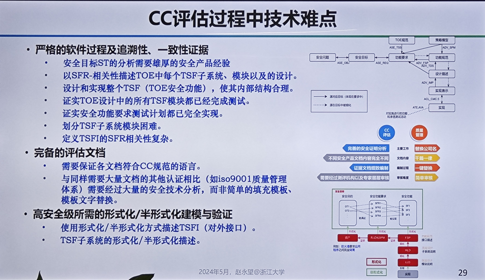
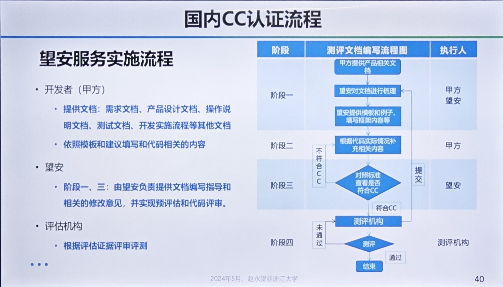

# CC信息安全高等级认证及形式化方法

## 背景
  - 数字化发展：提供便利的同时也带来了许多安全性的挑战；
  - 为什么软件有这么多问题？
    - 客观原因：软件规模太大，太复杂；
    - 主观原因：主流软件开发方法难以满足安全可靠要求。
  - 安全认证：
    - 国际信息技术安全评估标准 CC（Common Criteria）：定性分析
    - 各行各业各有标准
    - 通过严格的过程与证据来解决软件问题
    - 必备技术：形式化方法
 
 ## CC认证的标准和方法论
  - 从系统的“接口 + 弱点”上来抵御攻击
    - 接口的强约束
    - 设计的漏洞 bug
    - 环境过程
  - CC标准认证是安全行业最有含金量的认证
  - 安全目标：不同产品的“安全”是不一样的，面临的威胁也是不一样的。要保护什么？要防御什么？
   

## CC认证流程、案例和工具
### 国内CC认证流程

望安好像是赵老师开的公司。
小规模的好做，大规模的安全需求条数可能几十条或者上百条，做起来就难了。