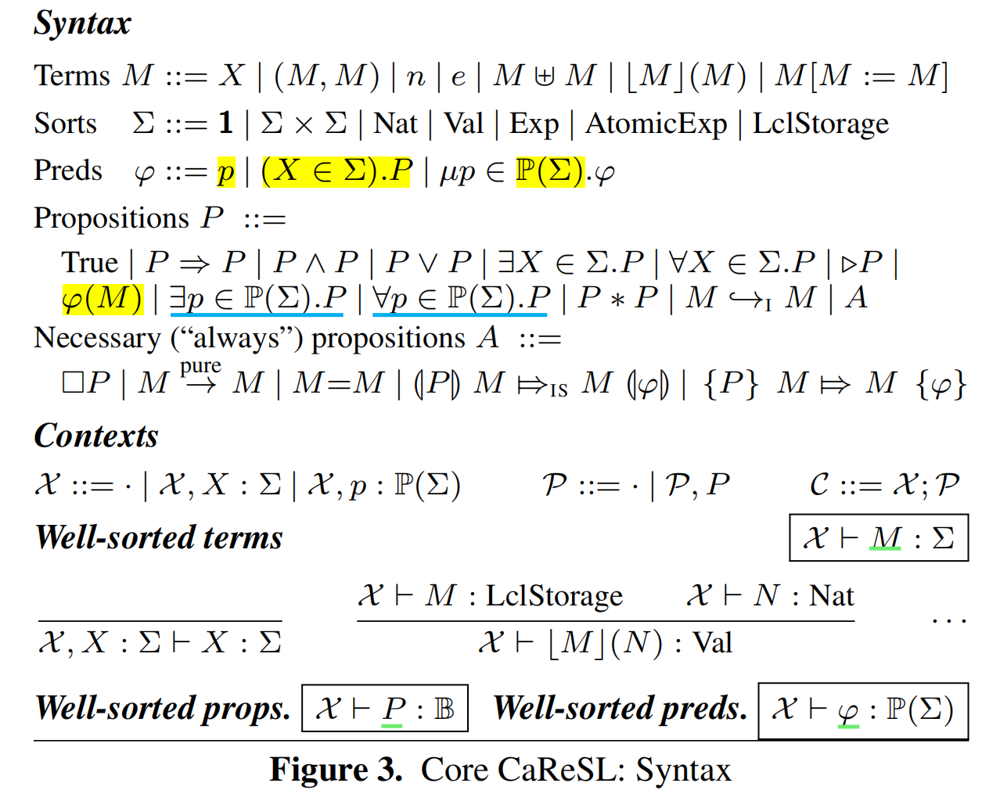
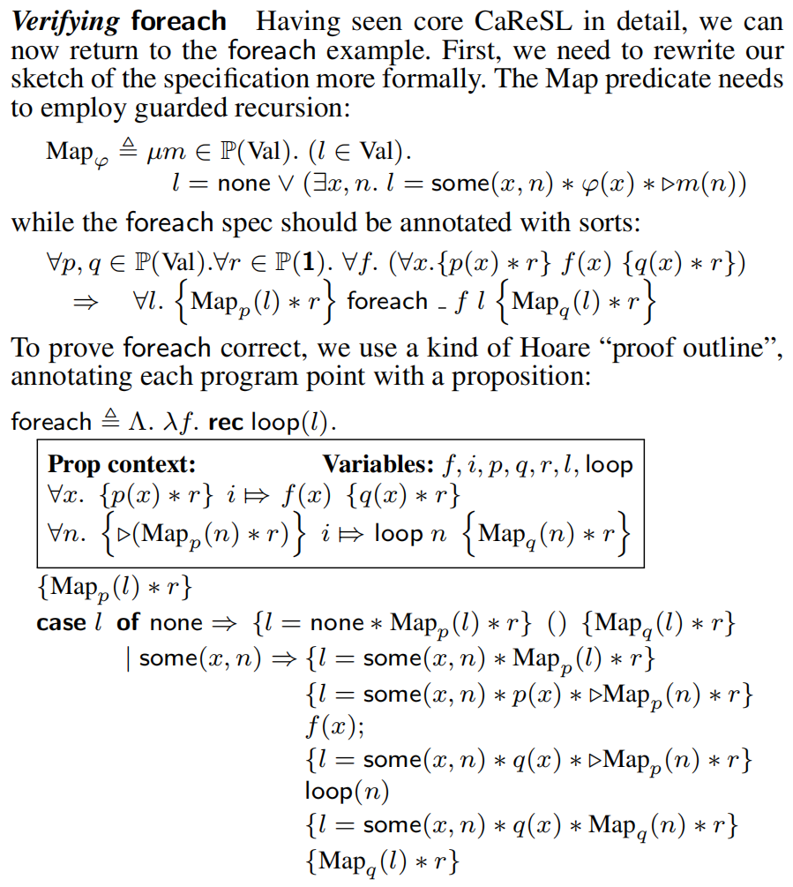

# CaReSL：在高阶并发逻辑中统一精化和Hoare风格推理
> Unifying Refinement and Hoare-Style Reasoning in a Logic for Higher-Order Concurrency
Aaron Turon、Derek Dreyer、Lars Birkedal

## 摘要
本文介绍了CaReSL，一种旨在支持高阶并发程序模块化验证的逻辑。它通过整合高阶函数和粒度抽象，解决了现有并发逻辑的局限性，这对于构建可重用组件和管理细粒度并发数据结构至关重要。

## 高阶函数
在编程语言中，高阶函数是那些可以接受其他函数作为参数或返回函数作为结果的函数。高阶函数的特点包括：
1. 接受函数作为参数：高阶函数可以接收其他函数作为输入，这些输入函数可以被调用，其结果可以被进一步处理。
2. 返回函数作为结果：高阶函数的输出可以是一个函数。这允许创建可定制的行为，因为返回的函数可以根据输入参数的不同而有不同的表现。
3. 操作函数：高阶函数可以对传递给它的函数进行操作，例如组合、变换或应用这些函数。

## 粒度抽象
粒度抽象（Granularity abstraction）是一种在并发编程中用来简化并发数据结构设计和验证的技术，核心思想是隐藏并发数据结构的内部复杂性，只给出一个简化的、高层次的接口给客户端使用。这样，客户端开发者就可以在不关心底层实现细节的情况下，安全地使用这些数据结构。
1. 隐藏内部状态：并发数据结构（如栈、队列）的内部状态（如，用于同步的锁、条件变量）对客户端是透明的。客户端只能通过定义好的接口（如push、pop操作）与数据结构交互。
2. 简化客户端推理：由于内部状态和同步机制被隐藏，客户端开发者在编写和验证代码时，不需要处理并发控制的复杂性。他们可以假设数据结构的操作是原子的，即使实际上这些操作可能涉及多个步骤和同步。
3. 上下文精化：粒度抽象允许开发者在不同的上下文中使用不同粒度的实现。例如，开发者可以提供一个粗粒度的参考实现（可能使用全局锁来简化并发控制），然后通过上下文精化证明一个细粒度的实现（可能使用更复杂的同步机制，如原子操作）在行为上与粗粒度实现一致。
4. 模块化验证：通过粒度抽象，验证工作可以被分解为两部分：首先证明细粒度实现是对粗粒度实现的上下文精化；然后使用Hoare风格推理来验证粗粒度实现满足客户端的规范。这种分解使得验证过程更加模块化，便于管理和复用。

## 平面组合
> Flat combining provides a generic way to turn a sequential ADT into a relatively effificient concurrent one, by having certain threads perform—in one fell swoop—the combined actions requested by a whole bunch of other threads.

## 框架
CaReSL的设计旨在支持高阶函数和粒度抽象，这对于创建可重用的程序组件和隐藏并发数据结构的复杂性至关重要。通过一系列示例，论文展示了CaReSL的特点，并使用它来证明Hendler等人的“平面组合”算法的部分正确性。

1. Treiber栈的精化：首先，作者证明了Treiber栈（一种细粒度的并发栈实现）精化了粗粒度（coarse-grained, CG）的栈参考实现。这意味着Treiber栈在行为上与一个更简单的栈实现等价，但可能在性能或资源使用上有改进。
2. Hoare风格验证：接着，使用Hoare风格推理来证明这个参考实现满足“逐项”（per-item）规范。这种规范可能涉及到栈操作（如push和pop）的正确性，确保每次操作都满足特定的前置条件和后置条件。
3. 平面组合算法的精化：最后，作者依赖于逐项规范来证明平面组合算法（flat combining algorithm）精化了一个更高级别的抽象。平面组合算法是一种并发构造，它允许多个线程的请求被一个线程统一处理，以提高效率。
4. 高阶代码和规范：案例研究的每个组件都涉及到高阶代码，因此需要高阶规范来描述和验证这些组件的行为。高阶规范能够处理函数作为参数或返回值的情况，这对于并发编程中的复杂交互尤为重要。

## 逻辑结构
CaReSL基于Kripke逻辑关系和并发分离逻辑的概念。它不将精化作为基本概念，而是从Hoare风格的推理中派生精化。CaReSL是一个模态逻辑，具有Kripke逻辑关系的可能世界，可以用来表达并发分离逻辑的共享状态协议。

## 语义
CaReSL的语义直接从Turon等人的模型中派生，该模型是第一个在类似ML的环境中为细粒度数据结构提供形式化精化证明的模型。

## 编程模型

CaReSL的编程语言模型包括多态lambda演算、原子比较和交换（CAS）以及线程局部引用。这些特性使得CaReSL能够处理复杂的并发程序。

## CaReSL的核心逻辑
CaReSL的核心逻辑提供了顺序（但高阶）程序的分离逻辑推理。通过引入并发性，CaReSL扩展了核心逻辑，并引入了“规范资源”来处理精化。

## 3.1 CaReSL的核心逻辑：顺序高阶程序
CaReSL的核心逻辑，提供了对顺序（但高阶）程序的分离逻辑推理。这意味着逻辑能够处理高阶函数，但前提假设程序是顺序执行的，不考虑并发。核心逻辑的关键特点包括：
- 分离逻辑：CaReSL使用分离逻辑来表达关于堆（heap）的断言，允许程序员声明某些资源是独立的，从而简化了对程序状态的推理。
- 模态逻辑：CaReSL是一个模态逻辑，它使用模态算子（如 $\Box$ ）来表达必然性，允许逻辑表达式在所有可能的资源配置下都为真。
- 命题和谓词：逻辑区分了命题（propositions）和谓词（predicates）。命题是关于程序行为的陈述，而谓词是参数化的命题，它们可以用来表达关于值或资源的属性。
- 递归和量化：CaReSL支持递归类型和量化。
证明foreach正确性
### foreach
$$
\begin{align*}
& \textbf{foreach} : \forall \alpha. (\alpha \rightarrow \textbf{1}) \rightarrow list(\alpha) \rightarrow \textbf{1} \\
& list(\alpha) \triangleq \mu \beta .\textbf{1} + (\alpha \times \beta) \\
& \begin{align*}
\textbf{foreach} \triangleq \Lambda.  \lambda f. \ \textbf{rec} \ loop(l). \quad \textbf{case} \quad l \quad & \textbf{of} && none &&&&\Rightarrow   () \\ & \mid && some(x,n) &&&&\Rightarrow  f(x); loop(n)
\end{align*}
\end{align*}
$$

!!! note 
    **foreach**函数是一个典型的高阶状态组合子，它接受一个函数$(\alpha \rightarrow \textbf{1})$和一个列表$list(\alpha)$作为参数，并应用给定的函数到列表的每个元素上。

    **foreach** 定义使用了模式匹配（case）来处理列表。当列表 l 为空（none）时，函数不执行任何操作（()）。当列表不为空（some(x, n)），即列表包含一个头部元素 x 和剩余部分 n 时，foreach首先应用函数 f 到头部元素 x 上，然后递归地对剩余的列表 n 调用自身。

    $\Lambda.e$ 代表类型抽象；

    $\textbf{rec} \ loop(l). e$ 代表递归函数（具体见下图）。

    $ \textbf{inj}_{i} \ e $代表 Sum Value

    有$none \triangleq \textbf{inj}_{1} \ ()$， $some(e) \triangleq \textbf{inj}_{2} \ e$

    $list(\alpha)$的定义还不太懂。它定义为（单元类型和（两个类型变量的积类型的）的和类型）的递归类型。

函数$f(x)$需要满足条件$$\forall x. \ \{p(x) * r\} \ f(x) \ \{q(x) * r\}$$
其中$p(x)$和$q(x)$为前置谓词和后置谓词，$r$为任意一个命题。这意味着函数$f(x)$将$p(x)$迁移到$q(x)$，并同时有不变量$r$成立。而**foreach**将满足这个特征的函数的行为上升到一个列表 $l$ 中。

为了假设$p(x)$在整个列表都成立，我们需要递归定义：$$\text{Map}_{p}(l) \triangleq \ l = none \vee (\exists x,n. \ l = some(x,n) * p(x) *\text{Map}_{p}(n))$$
对$q(x)$同理。

引出**foreach**规范：
$$ \forall p, q, r. \ \forall f. \ (\forall x. \{ p(x) * r \} \ f(x) \ \{q(x) * r \}) \\ \Rightarrow \forall l. \ \{\text{Map}_{p}(l) * r\} \ \textbf{foreach} \ \_ \ f \ l \ \{ \text{Map}_{q}(l) * r \}$$
    
!!! question
    **foreach** 后面的 _ 是什么？

### Syntax

上图定义了良序的项、命题和谓词。

!!! note
    $M$，$N$是项，$\Sigma$是类型，项有多种类型（sorts），这些类型包括语言中的值（values）、表达式（expressions），以及线程局部存储（thread-local storage）。

    $\mathcal{X}$是上下文信息，$\mathcal{X} \vdash M : \Sigma$ 是类型推断断言，它表明在变量上下文 $\mathcal{X}$ 下，项 $M$ 有类型 $\Sigma$。

    $P$、$Q$ 和 $R$ 都是命题。

    $\mathbb{P}(\Sigma)$ 含义？

    谓词 $\varphi$ 就是被一个项参数化的命题：
    
    $(X \in \Sigma).P$ 意味着命题 $P$ 与类型为 $\Sigma$ 的**未知**项 $X$ 绑定（bind）。（$X$ 是项的变元）

    $\mathbb{P}(\Sigma)$ 意味着谓词绑定的这个项 $X$ 的类型是 $\Sigma$，进而解释为谓词的**类型**。

    代入操作 $\varphi(M)$ （原文说这个也写作 $M \in \varphi$）就是将代入参数 $X$，使之变回命题。

    推断 $\mathcal{X} \vdash \varphi : \mathbb{P}(\Sigma)$ 说明类型为 $\Sigma$ 的谓词 $\varphi$ 是**良序**的。

> But to avoid cluttering our rules and proofs with sort annotationswe use **variables** $x, y, z$ for sort **Val** and $i, j, k, \ell$ for sort **Nat**. We abuse notation, writing e.g., $v, e$ or $L$ to stand for a term of sort **Val**, **Exp** or **LclStorage**, respectively.

在CaReSL的核心逻辑中，堆是唯一的资源。
*In core CaReSL, however, the only resource is the heap.*

!!! note
    **指向断言**：$\ell \hookrightarrow_{I} v$ 代表堆的某地址 $\ell$ 指向（具有）值 $v$。

#### 分离逻辑
分离逻辑（Separation Logic）是一种用于描述和验证并发程序中共享状态的逻辑系统，由计算机科学家Peter O'Hearn和他的同事们在2004年左右提出的，旨在解决并发程序验证中的一些基本问题，特别是在处理共享资源和并发操作时的复杂性。

分离逻辑的核心概念是“分离”（separation），它允许程序员声明程序中不同部分的内存是相互独立的。这意味着，当一个线程在操作一部分内存时，可以假设其他线程不会干扰这部分内存，从而简化了对并发行为的推理。

分离逻辑的主要特点包括：
1. 分离断言：分离逻辑使用特殊的断言 $P ∗ Q$ 来表示两个命题 $P$ 和 $Q$ 描述的内存区域是分离的。这种断言允许程序员明确地表达出在并发程序中哪些部分是相互独立的。
2. 局部推理：分离逻辑支持局部推理，即程序员可以只关注程序的一小部分（例如，一个线程或一个操作），而不需要考虑整个程序的状态。
3. 原子操作：分离逻辑通常与原子操作（如原子比较和交换，即**CAS**）结合使用，这些操作保证了在并发环境中对共享资源的访问是安全的。
4. 协议：在分离逻辑中，可以定义协议来描述线程如何协调对共享资源的访问。这些协议有助于表达并发程序中的**同步**机制。
5. 组合性：分离逻辑支持组合性，这意味着可以独立地验证程序的不同部分，然后将这些部分组合起来验证整个程序。

!!! note

    在CaReSL中，某些命题（如指向断言$\ell \hookrightarrow_{I} v$）的真实性取决于特定的资源（如内存位置）是否存在。另一些命题，如项等价（$M = N$），是必然的。这意味着它们的真实性不受当前资源状态的影响，无论资源如何变化，这些命题都将始终为真。

    **纯命题**：在分离逻辑中，上述这类不受资源状态影响的命题被称为“纯”命题。

    必然命题的语法子类别 $A$：这个子类别包括了关于项等价、操作语义（例如，表达式 $M$ 在纯步骤中可以转换为 $N$）以及 Hoare 三元组的声明。

    通过**模态**算子 $\Box$ 创造必然命题：任何命题都可以通过模态算子 $\Box$ （表示“总是”）来转变为必然命题。如果命题 $P$ 在所有可能的资源状态下都为真，那么 $\Box P$ 也必然为真。

    必然命题的特殊规则：在逻辑推理中，必然命题可以自由地在Hoare三元组和分离连接词之间移动。这表明必然命题在逻辑系统中具有特殊的地位，它们不受资源状态变化的影响，使得在进行逻辑推理时可以更加灵活地处理这些命题。

#### Kripke 可能世界 模态逻辑
这里讨论的模态逻辑是指只含有一个模态算子的模态命题逻辑，相比于古典命题逻辑，这个逻辑仅仅多了一个一元联词$\Box$，也称为模态算子。基于此，添加了新的合式公式的形成规则：如果$\alpha$是一个合式公式，则$(\Box \alpha)$也是。引入$\Diamond \alpha$作为$\neg \Box \neg \alpha$的简写。为了唯一可读性，$\Box$和$\Diamond$的管辖范围都尽可能短。

联词$\Box$和$\Diamond$通常被解释成"必然"和"可能"。

**定义:**

(1) 称一个二元组 $F = (W, R)$ 为一个**框架**, 如果 $W$ 非空且 $R$ 为 $W$ 上的一个二元关系；
(2) 称一个从命题符号的集合到$W$的幂集的一个映射$V$为一个**赋值**；
(3) 称一个由**框架**和**赋值**形成的二元组 $M = (F, V)$ 为一个（克里普克）**模型**。模型$M$也常常被写作 $M = (W, R, V)$。

沿用克里普克本人的解释，人们习惯上称$W$中的元素为一个可能世界或世界;并且称$xRy$为从 $x$ 可以通达 $y$（甚至可以更富有暗示性地读作" $y$ 是 $x$ 的一个将来世界"，尽管这种暗示有它的片面性）;对每个命题符号 $A$ 赋值 $V$ 指派给 $A$ 的集合 $V(A)$ 就是那些 $A$ 在其中成立的可能世界的集合。在实际应用中，如果只关心涉及命题符号(比方说) $A,B,C$ 的模态公式那么只需考虑赋值 $V$ 在 $A,B,C$ 上的定义就可以了，这一点是很自然的。

**定义:**
归纳定义一个模态公式$\alpha$在模型$M$中的世界$w$中为真记作$(M,w) \models \alpha$,

(1) 对命题符号 $A_{i}$，$(M,w) \models A_{i}$，当且仅当$w \in V(A_{i})$；

(2) $(M,w)\models(\neg \beta)$，当且仅当$(M,w) \not\models \beta$(即$(M,w) \models \beta$不成立)；

(3) $(M,w)\models(\beta \rightarrow \gamma)$，当且仅当$(M,w)\not\models(\beta)$或者$(M,w) \models \gamma$；

(4) $(M,w)\models \Box \beta$，当且仅当对任意的$w^{'} \in W$，如果 $Rww^{'}$，则$(M, w^{'}) \models \beta$。

如果$(M,w)\not\models\alpha$，则称$\alpha$ 在模型$M$中的世界$w$中为假。

**定义:** 称$\alpha$ 在模型
$M =(W, R, V)$中有效，记作$M \models \alpha$，如果对所有的$w\in W$都有$(M,w)\models\alpha$。

**例**  考虑框架$F=(W, R)$，其中$W={u,u,w}$，$R={(u,u),(u,w)}$。定义赋值 $V :\{A,B\} \rightarrow P(W)$为$V(A)= \{u, v\}$和$V(B)= \{ v\}$。则 $(M, u) \models \Box(A \rightarrow B)$ 但 $(M, u) \not\models A \rightarrow \Box B$ 。

1)  $(M, u) \models \Box(A \rightarrow B)$\
    根据定义，有$uRv$和$uRW$。\
    对于$uRv$，由于$(M, v) \models A$且$(M, v) \models B$,故$(M, v) \models A\rightarrow B$;\
    对于$uRw$, 由于$(M, w) \not \models A$，故
    $(M, v) \models A\rightarrow B$。\
    因此$(M, u) \models \Box(A \rightarrow B)$。

2)  $(M, u) \not\models A \rightarrow \Box B$\
    对于$uRw$，有$(M, w) \not \models B$，故$(M, u) \not \models \Box B$。\
    根据定义，又由于$(M, u) \models A$，有$(M, u) \not\models A \rightarrow \Box B$。

**定义:**
称$\alpha$为普遍有效的，记作$\models \alpha$，如果对所有的模型$M$，都有$M\models \alpha$。

#### 模态逻辑的一个推理系统$K$

在古典命题逻辑的推理系统进行如下的扩张。首先，在(A1)，(A2)和(A3)公理之上添加新的公理：
$$K: \Box(\alpha \rightarrow \beta) \rightarrow (\Box \alpha \rightarrow \Box \beta)$$
并且，在所有公理中，$\alpha$, $\beta$, $\gamma$可以被任何的模态公式替换。其次，添加新的必然化规则RN：从$\alpha$可以得到$\Box \alpha$。

**注意**:由于系统 K 增加了必然化规则，演绎定理不一定成立

由于$K$是古典命题逻辑推演系统工的一个扩张，因此$K$自然可以证明所有的重言式。但这里需要澄清在模态语言中重言式的概念。首先把所有的命题符号和形如$(\Box \alpha)$的模态公式全部列出来:
$\beta_{1},\beta_{2},\dots$,
并且给它们中的每一个都指派一个新的命题符号，例如，用$B_{i}$代表$\beta_{i}$。这样，每个模态公式都成为关于命题符号$B_{i}$的古典公式。例如，假定$A_{3}$和$\Box \Box(A_{1} \rightarrow \Box A_{2})$分别是$B_{5}$和$B_{29}$，则模态公式$A_{3} \rightarrow (\neg  A_{3}) \rightarrow \Box \Box(A_{1} \rightarrow \Box A_{2})$就是$B_{5} \rightarrow \neg B_{5} \rightarrow B_{29}$。称一个模态公式为一个(模态的)重言式，如果经过上述变换后得到的关于$B_{i}$的公式是古典意义下的重言式[@logic]。下面的事实会给我们带来很大的方便:

**引理**: 如果$\alpha$是一个模态的重言式，则$\vdash_{K} \alpha$。

**引理**: 如果$\{ \alpha: \Box \alpha \in \Gamma \} \vdash_{K} \beta$，则$\Gamma \vdash_{K} \Box \beta$。

#### 原子表达式 $a$
> Ultimately, CaReSL distinguishes between triples about general expressions e and those about *atomic* expressions $a$ (which execute in a single step). Since this distinction is motivated by concurrency, we postpone its explanation to $\S$3.2. We include the distinction syntactically in core CaReSL, but it can be safely ignored for now.

原子表达式的语法定义如下：
$$ \textbf{new} \ v \mid \textbf{get} \ v \mid v := v \mid \textbf{CAS}(v,v,v) \mid \textbf{newLcl} \mid \textbf{getLcl}(v) \mid \textbf{setLcl}(v,v)$$
这里 $v$ 代表值类型。
*We abuse notation, writing e.g., ==$v$==, $e$ or $L$ to stand for a term of sort ==Val==, Exp or LclStorage, respectively.*

<!-- $\usepackage[stmaryrd]{}$
\llparenthesis
\Mapsto
 -->

下面的公式需要导入额外的包，暂时先用符号拼一下啊:sob: 
原子三元组：$(\!\lvert P \lvert\!) \ i \ \shortmid \! \Rightarrow_{\text{IS}} a \ (\!\lvert \varphi \lvert\!)$
一般三元组：$\{ P \} \ i \ \shortmid \! \Rightarrow e \ \{ \varphi \} $
模态联词 $\triangleright Q$ 表示 $Q$ 至少在一步计算内成立。

### 公理

!!! note

    “throw away” resources: **True**是分离联词 * 的单位元并且每个命题都蕴含True，然后有$(P * Q) \Rightarrow (True * Q) \Rightarrow Q$

    freely copied：当有necessary proposition作为操作数时，联词 * 和 $\land$ 是恒等的，有 $A * A \Rightarrow A$

    Mono

    LOB

### foreach 证明

## 3.2 添加并发性
为了推理并发性，需要对管理共享（通常是隐藏的）状态的协议进行推理。

!!! note 协议
    **协议$\pi$** 通过一组 **协议状态$S$** 来抽象地管理共享资源。

    状态间的**迁移关系**用 $\rightsquigarrow$  来表示。

    对每一个**状态 $s \in S$** 都有一个与之相关 **命题 $\varphi (s)$** 来解释。
    
    每一步**原子操作**的具体更新都对应着一个允许的抽象转移。

    通过转换，一个线程可以从协议中“获得”一个令牌；相反，某些转换需要一个线程“支付”以前获得的令牌（放弃令牌）。
    *By taking a transition, a thread may “earn” a token from the protocol; conversely, certain transitions require a thread to “pay” by giving up a previously-earned token.*

    一般来说，所有的线程都必须遵守给定的协议，但并不是所有线程都在其中扮演相同的角色。

    具体而言：
    $\pi = (S, \rightsquigarrow, \mathcal{T}, \varphi)$
    其中，$(S, \rightsquigarrow)$ 是转换系统；
    函数 $\mathcal{T}$ 给出每个状态下协议拥有的**令牌集**；
    谓词 $\varphi$ 给出了这些状态对应的解释。
    

    转换系统和令牌的组合产生了令牌敏感的转换。
    $\pi$允许从状态/标记$(s;T)$转换到状态/标记$(s';T')$，写作：$(s;T) \rightsquigarrow_{\pi} (s';T')$，只要求令牌保护定律成立：线程的令牌和协议的令牌不相交并集必须在转换前后相同（$T\uplus\pi.\mathcal{T}(s) = T'\uplus\pi.\mathcal{T}(s')$）。
    令牌敏感的转换限制了线程和其环境的行为。
    
### 自旋锁的定义

$mkSync$函数创建了一个同步机制，它确保对某个资源的访问遵循特定的协议。在这里，资源 $p$ 被看作一个不变量，即在同步操作开始和结束时，其值或状态保持不变。

$Syncer(p)$是一个高阶函数，它接收另一个函数 $f$ 和相关的断言，并确保 $f$ 的执行维持了 $p$ 的不变性。这意味着在 $f$ 执行期间，资源 $p$ 是被 $f$ 独占的，没有其他操作可以修改它。

隐藏锁意味着锁的状态对于客户端是不可见的，客户端只能通过 $mkSync$提供的接口与锁进行交互。

### 岛断言

$\boxed{b}^n_\pi$
b: sort State × TokSet
n: name
$\pi$ : protocols

While a thread’s island assertions cannot be invalidated by a change its environment makes, they can be invalidated by a change the thread itself makes.

There is, however, a special class of island assertions which are “completely” stable, i.e., that act as necessary propositions: island assertions that do not claim any tokens.

两个规则：NEWISL和UPDISL

### 线程创建
In a protocol, threads gain and lose roles (tokens) by making deliberate moves within the protocol. But there is also a role that every thread plays automatically: the role of being a thread with a certain ID.

通过FORK规则创建新的线程

### 自旋锁的证明

"令牌纯净"是一种属性，表示一个状态或者命题不会断言对一些资源的所有权。
- 分配一个隐藏的锁，然后使用$NEWISL$ 规则将此锁移到一个新的岛断言中；
- 使用 $AOUT$  将岛断言移动到证明上下文中；
- 在前置条件 $q$ 下进行证明，使用 $AIN$ 规则将岛断言引入。
- 使用 $\text{acq}$ 函数尝试获取锁，如果成功，则执行 $f$ 函数，并在完成后使用 $\text{rel}$ 函数释放锁。$\text{acq}$ 函数通过 $CAS$ 操作来尝试获取锁，如果锁已经是 $Locked$ 状态，则 $\text{acq}$ 会重试。
- $\text{rel}$ 函数简单地将锁的状态设置为 $Unlocked$ ，从而释放锁。
- $\text{acq}$ 和 $\text{rel}$ 函数操作最终都要上升到 $UPDISL$ 规则。

## 3.3 精化推理 
CaReSL并没有简单地在并行分离逻辑之上添加精化作为原子概念。相反，CaReSL将精化视为派生概念，表示为特定的Hoare样式规范。

两个基本规范断言：
规范指向断言: $\ell \hookrightarrow_{S} v$ ，声称规范堆的一部分所有权：包含一个位置 $\ell$ 指向值 $v$ ，
规范线程断言: $i \shortmid \! \Rightarrow_S e$ ，声称一个规范线程的所有权，该规范线程ID是 $i$，执行表达式 $e$ 。

### CaReSL中的实现与规范之间的逻辑关系

在给定上下文 $\Omega$ 和类型 $\tau$ 下，逻辑关系 $e_{I} \preceq e_{S} : \tau$ 表示 $e_{I}$ （实现表达式）是 $e_{S}$ （规范表达式）的逻辑细化，即 $e_{I}$ 的行为不会超出 $e_{S}$ 所定义的行为。

#### 逻辑关系
- $e_{I} \preceq e_{S} : \tau$ 表示在上下文 $\Omega$ 和类型 $\tau$ 下，$e_{I}$ 逻辑上相关于 $e_{S}$。
- 这个关系是通过CaReSL中的 $\Omega \vdash e_{I} \preceq e_{S} : \tau$ 判断来使用的，其中 $\Omega$ 是证明的上下文。

#### 证明上下文
- 在证明上下文中，所有的类型变量 $\alpha$ 都会被赋予任意的类型解释，所有的项变量 $x$ 都会被赋予在适当类型下相关联的项变量对。这意味着证明上下文提供了足够的信息来解释类型和项，从而使逻辑关系得以建立。

#### 共享不变性协议
- 对于类型为 $ref \ \tau$ 的项（例如，具有引用类型的项），证明上下文会提供对共享不变性协议的访问。这个协议规定了对应位置的不变性要求，确保实现中的引用更新与规范中的更新同步进行。

#### 私有引用
- 如果引用是在实现或规范内部分配的（即私有引用），它们不需要遵循共享不变性协议，除非它们被暴露给外部。这表明私有引用的行为可以在不违反规范的前提下，有更多的自由度。

!!! note Stack
    作者描述了一个简单的细化证明的草图，并介绍了两种堆栈的实现。第一种实现是 $stack_{S}$。它是一个粗粒度的参考实现，文中将其视为规范。$stack_{S}$ 的特点如下：

    1. **数据表示**：$stack_{S}$ 包含一个可变的引用 $hd_{S}$，它指向一个不可变的列表。这种数据结构通常用于表示栈的内容。

    2. **同步包装器**： $stack_{S}$ 使用由 $mkSync$ 提供的同步包装器 $sync$ 来确保对栈的并发访问是线程安全的。

    3. **函数**：$stack_{S}$ 提供了 $push$ 和 $pop$ 函数，这些函数通过同步机制来更新 $hd_{S}$。这意味着在执行入栈和出栈操作时，会锁定栈，防止其他线程同时修改。

    4. **迭代器的同步问题**：尽管 $push$ 和 $pop$ 操作是同步的，但 $stack_{S}$ 的迭代器并不是完全同步的。迭代器通过原子快照（atomic snapshot）的方式获取栈的当前状态，然后对其每个元素调用函数 $f$。而在上述过程中迭代器不持有任何锁，所以在调用函数$f$时，栈的内容可能已经发生了变化。这意味着迭代器观察到的栈状态可能是过时的，不反映当前的最新状态。

    ### Treiber堆栈及其迭代器

    第二种堆栈实现 $stack_{I}$是Treiber堆栈（Treiber's stack）的扩展版本，增加了迭代器功能。

    1. **Treiber堆栈**：Treiber堆栈是一种无锁的数据结构，用于在并发环境中实现栈。它通过使用原子操作CAS来更新堆栈顶部的引用（$hd_{I}$），而不需要使用互斥锁。
    2. **数据表示**：$stack_{I}$ 维护一个引用 $hd_{I}$，指向一个列表，该列表用于表示栈的内容。$hd_{I}$ 的类型是 $ref \  clist \ (\alpha)$，其中 $clist \ (\alpha)$ 是一个使用了递归类型（$\mu\beta.$）的链表类型，表示为 $ref \ (1 + (\alpha \times \beta))$，这里的 $1$ 表示空列表，$\alpha \times \beta$ 表示非空节点，包含一个元素和一个指向下一个节点的引用。

    3. **乐观并发**： $stack_{I}$ 的 $push$ 和 $pop$ 函数采用乐观并发策略。它们不是通过获取锁来通知其他线程即将进行更改，而是首先获取当前 $hd_{I}$ 的快照，计算新值，然后使用CAS操作尝试安装这个新值。如果 $hd_{I}$ 的身份没有改变，那么CAS操作就会成功。直观原理就是，如果 $hd_{I}$ 的身份没有改变，那么栈的内容也没有改变，因为所有的变更都是通过改变 $hd_{I}$ 的身份来完成的。

    4. **迭代器行为**： $stack_{I}$ 的迭代器可以从一个（可能是过时的）$hd_{I}$ 快照开始，遍历栈的内容。但由于迭代器不持有锁，所以它可能观察到的栈状态不是最新的。

## 案例研究
论文使用CaReSL来验证Hendler等人的“平面组合”算法。这是一个将顺序ADT转换为相对高效的并发ADT的通用方法，展示了CaReSL在实际应用中的有效性。

## 结论
CaReSL展示了在高阶并发程序中统一精化和Hoare风格推理的可能性。通过案例研究，证明了CaReSL在实际应用中的有效性和灵活性。CaReSL的提出，为并发程序的模块化验证提供了新的视角和工具。

